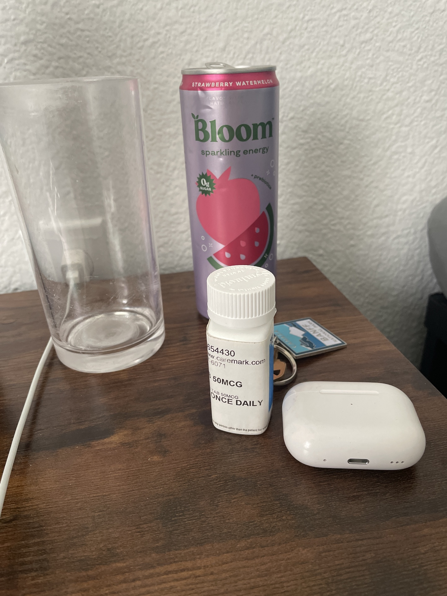

```{r setup, include=FALSE}
knitr::opts_chunk$set(echo = FALSE, message = FALSE, warning = FALSE)
```

# Hi, I’m Asim 👋

I’m a UT Austin student focused on **data science** and **computational genomics**.  
Recent work includes scalable sequence counting (HyperLogLog vs exact hashing), ML for genomic sequence completion, and livability analytics with Polco.

[Check out my GitHub](https://github.com/asimw4)

{width=240px}

## A few things I’m into
- Bio/health ML tools (bench → bedside)  
- Clean, reproducible data workflows  

**Build time:**  
```{r echo=FALSE, results='asis'}
format(Sys.time(), "%Y-%m-%d %H:%M:%S %Z")
```
